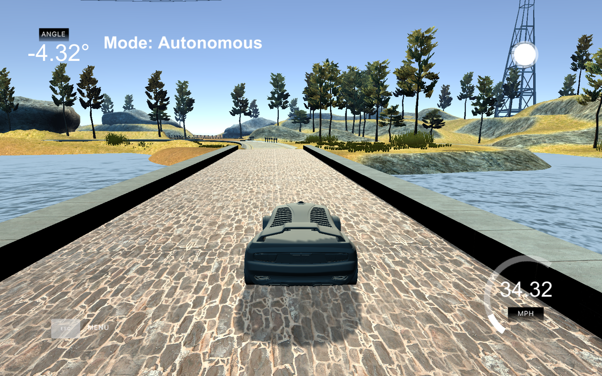

# Driving a Vehicle with PID Control

The pid controller is very important and small project 
the aim of the project is to keep car on track and consitant towards the track 
------
### What does pid stands for 

PID is stands for   Proportional-Integral-Derivative Controller

The "P" for proportional means that the car will steer in proportion to the cross-track error, or CTE. As the car is to the left of the line then you would want to steer to the right and  if it is far to the left of the middle with a high CTE then you want a higher steering angle. 
The "I" for integral sums up all CTEs up to that point, such that too many negative CTEs , i.e car is  back toward the middle, preventing the car from driving on one side of the lane the whole time.
The "D" for derivate is the change in CTE from one value to the next. This means that  
1) if the derivative is quickly changing, the car will correct itself i.e. higher steering angle faster, such as in the case of a curve, and

2) if the car is moving outward from the middle, this will cause the steering to get larger as the derivative sign will match the proportional sign, but if the car is moving toward the center (meaning the derivative value will be negative


-----

### Final hyper params 

I have done manual tuning in order to get the right hyper parameter 
```
double Kp =-0.15;
double Ki =0.002;
double Kd =-2.5;
```
The above are the  P, I, D coefficients  that I chose so that car can stay on track 

### Youtube link of the project is following
-------------------------------------------
| <a href="https://youtu.be/nrkpTsLLPrM" ><strong>Project Vidoe </storng></a>|
------------------

----

### Images from the Project





